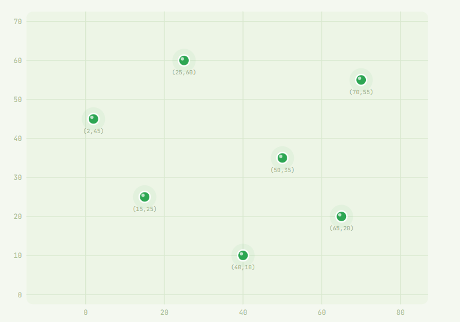
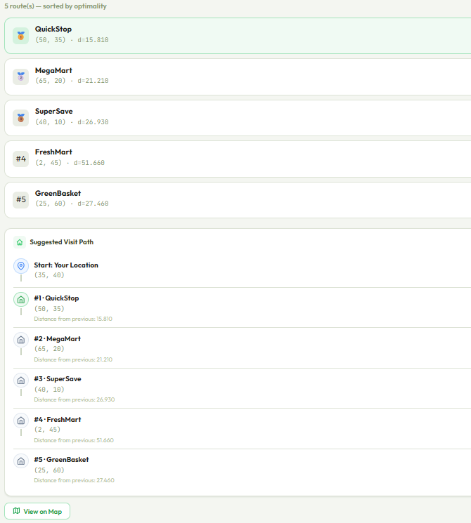
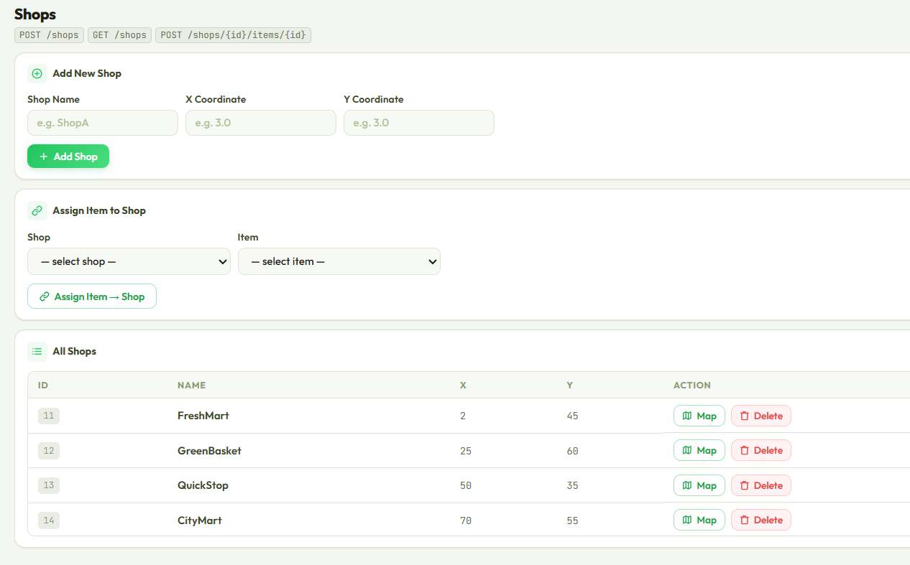
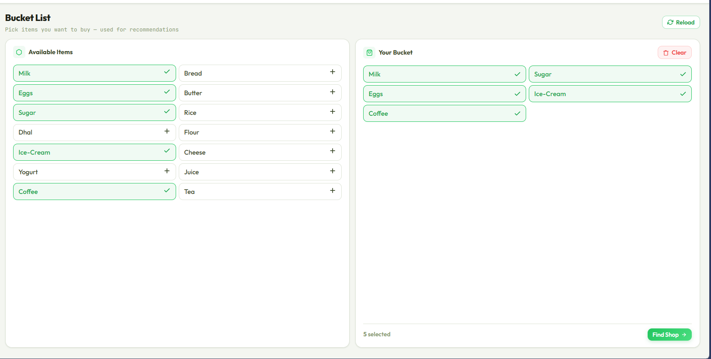
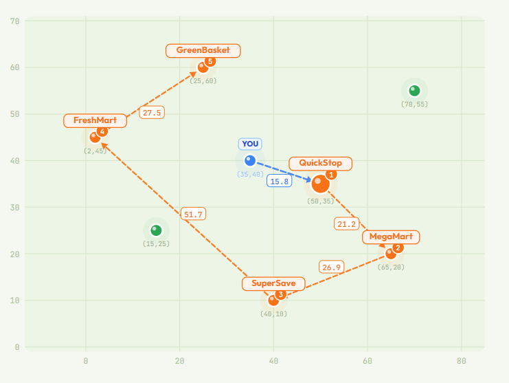
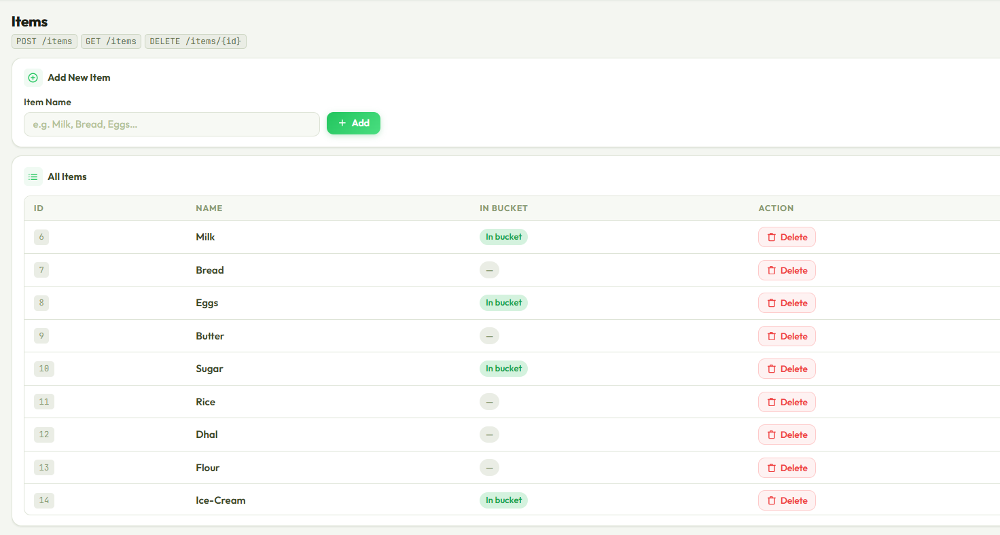

# 🛒 Smart Grocery Finder

[](https://github.com/senura-sandeepa/Smart-Grocery-Finder/actions)
[](https://smart-grocery-finder-production.up.railway.app)

A coordinate-based grocery shop recommendation engine built with Java and Spring Boot — featuring two custom algorithms, a real-time SVG map, automated tests, CI/CD pipeline, and Docker deployment.

---

## 🚀 Live Demo

🌐 **[smart-grocery-finder-production.up.railway.app](https://smart-grocery-finder-production.up.railway.app)**

---

## 📸 Screenshots
<table width="100%">
  <tr>
    <td width="40%" valign="top">
      <strong>🗺️ Map View</strong><br/>
      
    </td>
    <td width="60%" rowspan="3" valign="top">
      <strong>📍 Advanced Multi-Shop Route Result</strong><br/>
      
    </td>
  </tr>
  <tr>
    <td width="40%" valign="top">
      <strong>🏪 Shops Management</strong><br/>
      
    </td>
  </tr>
  <tr>
    <td width="40%" valign="top">
      <strong>🛒 Bucket List</strong><br/>
      
    </td>
  </tr>
  <tr>
    <td width="40%" valign="top">
      <strong>🗺️ Map with Route</strong><br/>
      
    </td>
    <td width="60%" valign="top">
      <strong>📦 Items Management</strong><br/>
      
    </td>
  </tr>
</table>

---

## ✨ Features

- 🔍 **Basic Recommendation** — Finds the single best shop covering the most requested grocery items
- 🗺️ **Advanced Multi-Shop Route** — Greedy nearest-neighbour algorithm finds the shortest travel route across multiple shops
- 📍 **Real-time SVG Map** — Interactive coordinate map with animated route arrows and distance labels
- ✅ **12 Automated Tests** — Unit and integration tests using JUnit 5 and Mockito with H2 in-memory database
- 🐳 **Docker Support** — Full stack containerized with docker-compose — one command to run
- ⚙️ **CI/CD Pipeline** — Automated testing and build on every push via GitHub Actions

---

## 🛠️ Tech Stack

| Layer | Technology |
|---|---|
| Backend | Java 17, Spring Boot 3.2, Spring Data JPA, Hibernate |
| Database | MySQL, Flyway migrations |
| Frontend | Vanilla JavaScript, HTML5, CSS3 |
| Testing | JUnit 5, Mockito, H2 |
| DevOps | Docker, docker-compose, GitHub Actions, Railway |

---

## 📐 Algorithm

### Basic (`POST /recommend`)
Finds the **single best shop** by:
1. Counting how many requested items each shop has
2. Returning the shop with the most matches
3. Using distance as a tiebreaker when match count is equal

### Advanced (`POST /recommend/advanced`)
Finds the **optimal multi-shop route** using greedy nearest-neighbour:
1. From current position, find the nearest shop that has any needed items
2. Visit that shop, collect items, update current position
3. Repeat until all items are collected
4. Returns ordered list of shops with step distances and cumulative distance

---

## 🗄️ Database Schema
```
shops            items          shop_items
─────────────    ──────         ──────────────
id (PK)          id (PK)        shop_id (FK)
name             name           item_id (FK)
x_coordinate
y_coordinate
```

---

## 🚦 API Endpoints

| Method | Endpoint | Description |
|---|---|---|
| POST | `/items` | Create a new item |
| GET | `/items` | Get all items |
| DELETE | `/items/{id}` | Delete an item |
| POST | `/shops` | Create a new shop |
| GET | `/shops` | Get all shops |
| POST | `/shops/{shopId}/items/{itemId}` | Assign item to shop |
| POST | `/recommend` | Basic — best single shop |
| POST | `/recommend/advanced` | Advanced — optimal multi-shop route |

---

## ▶️ Run Locally

### Option 1 — Docker (Recommended)
```bash
docker-compose up
```

App runs at `http://localhost:8080` ✅

No Java or MySQL installation needed.

### Option 2 — Manual

**Prerequisites:** Java 17, MySQL

**Step 1** — Clone the repo:
```bash
git clone https://github.com/senura-sandeepa/Smart-Grocery-Finder.git
```

**Step 2** — Update `src/main/resources/application.yml` with your MySQL credentials

**Step 3** — Run:
```bash
./mvnw spring-boot:run
```

---

## 🧪 Run Tests
```bash
./mvnw test
```
```
Tests run: 12, Failures: 0, Errors: 0 ✅
```

Tests run without MySQL — uses H2 in-memory database automatically.

---

## 👨‍💻 Author

**Senura Sandeepa** — [GitHub](https://github.com/senura-sandeepa) · [LinkedIn](https://linkedin.com/in/senura-sandeepa)